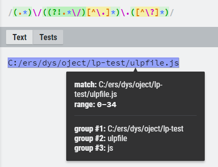

```typescript
var tl = 'eddy aaa';
const rex = new RegExp(`(eddy)`, 'gi');
const text = `<span class="highlight">$1</span>`
const tt = tl.replace(rex, text);
```

```typescript
export function latitudeFormat(tude : string) {
    let t = tude.replace(/(\d+)\/(\d+)/g,($0,$1,$2)=>{
      return ($1 / $2).toString();
    })
    let [degree, minute, second] = t.split(',');
    return parseFloat(degree) + (parseFloat(minute) / 60) + (parseFloat(second)/3600);
  }
```

