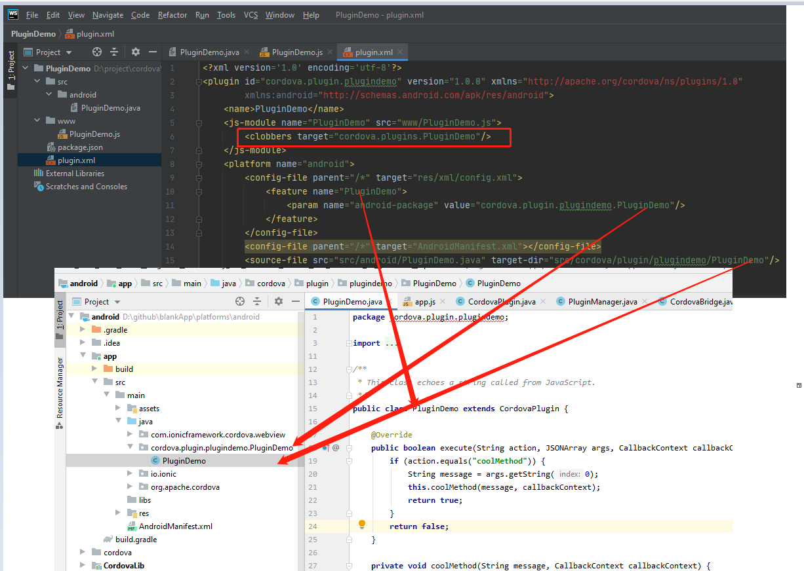

- 创建插件

```bash
# npm install -g plugman
npm install -g plugman

# plugman create --name <pluginName> --plugin_id <pluginId> --        plugin_version 1.0.0

# plugin id用点号分隔
plugman create --name PluginDemo --plugin_id cordova.plugin.plugindemo --plugin_version 1.0.0

cd PluginDemo/
plugman platform add --platform_name android

plugman createpackagejson .

#push to github: https://github.com/eddyshn/cordova-plugin-demo.git
```

- 测试工程

```bash
ionic start blankApp blank

ionic cordova platform add android

ionic cordova plugin add https://github.com/eddyshn/cordova-plugin-demo.git
```

- 调用插件

```typescript
nativeToast(){
    (window as any).cordova.plugins.PluginDemo.coolMethod(this.inputValue, (x) => {
      console.log(x);
    }, (x) => {
      console.log(x);
    });
  }
```


> 中以看到cordova plugin 是attach 到window上的, exports.coolMethod的命名空间来源于<clobbers target="cordova.plugins.PluginDemo"/>



- 封装插件便于调用

  ```typescript
  import { Injectable } from '@angular/core';
  import { Observable, Observer } from 'rxjs';
  
  @Injectable({
      providedIn: 'root'
  })
  
  export class PluginDemo {
      coolMethod(arg0) {
          return new Observable(subscriber  => {
              (window as any).cordova.plugins.PluginDemo.coolMethod(arg0,
                  (data: any) => {
                      subscriber .next(data);
                      subscriber .complete();
                  },
                  (error: any) => {
                      subscriber .error(error);
                  }
              );
          });
      }
  }
  ```

- github demo

  https://github.com/eddyshn/cordova-plugin-demo.git

  https://github.com/eddyshn/kb-code/tree/main/cordova/plugin-test-app

  

- 参考资料

  https://cordova.apache.org/docs/en/latest/guide/hybrid/plugins/index.html

  https://medium.com/@durgavundavalli/ionic5-cordova-custom-plugin-for-objective-c-e4e82c5fbc3b

  https://medium.com/@durgavundavalli/cordova-create-a-native-wrapper-with-ionic-native-d88fbc6742a2

  https://www.youtube.com/watch?v=Q6PaFEDonac&t=665s