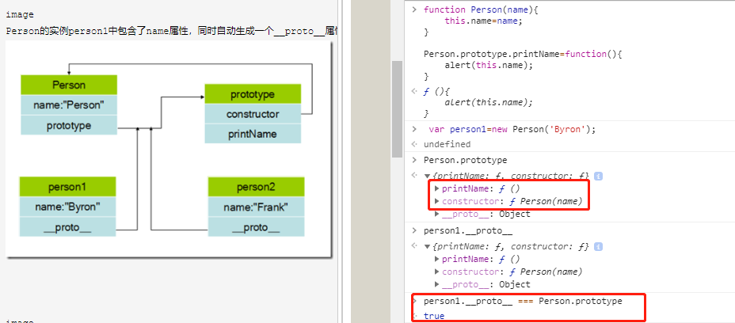

# 3 函数作用域和块作用域  

# 4 提升

```javascript
foo(); //2
foo2(); //undefined
foo3(); //TypeError: foo3 is not a function

function foo() {
    a = 1;
    var a;
    console.log(a); //2
}

function foo2() {
    console.log(a); //undefined
    var a = 2;
}


var foo3 = function (){
    a = 1;
    var a;
    console.log(a);
}

// 上面的代码相当于
var a;
a = 1;
console.log( a );

var b;
console.log( b );
b = 1;
```

>  当你看到 var a = 2; 时， 可能会认为这是一个声明。 但 JavaScript 实际上会将其看成两个声明： var a; 和 a = 2;。 第一个定义声明是在**编译阶段**进行的。 第二个赋值声明会被留在**原地等待执行阶段**。
>
> 只有声明本身会被提升， 而赋值或其他运行逻辑会留在原地 

> 每个作用域都会进行提升操作  
>
> 函数声明会被提升， 但是函数表达式却不会被提升  


# 闭包

```javascript
function foo() {
var a = 2;
function bar() {
console.log( a );
}
return bar;
}
var baz = foo();
baz(); // 2 —— 朋友， 这就是闭包的效果。
```


>  将内部函数传递到所在的词法作用域以外， 它都会持有对原始定义作用域的引用，这个引用就叫闭包.
>
> 只要使用了回调函数， 实际上就是在使用闭包！  


## 循环和闭包

```javascript
for (var i=1; i<=5; i++) {
    setTimeout( function timer() {
        console.log( i );
    }, i*1000 );
}//输出5个6

for (var i=1; i<=5; i++) {
    (function() {
        setTimeout( function timer() {
            console.log( i );
        }, i*1000 );
    })();
}//输出5个6

for (var i=1; i<=5; i++) {
    (function() {
        var j = i;
        setTimeout( function timer() {
            console.log( j );
        }, j*1000 );
    })();
}

for (var i=1; i<=5; i++) {
    (function(j) {
        setTimeout( function timer() {
            console.log( j );
        }, j*1000 );
    })( i );
}

for (let i=1; i<=5; i++) {
    setTimeout( function timer() {
        console.log( i );
    }, i*1000 );
}
```


> 实际情况是尽管循环中的五个函数是在各个迭代中分别定义的，但是它们都被封闭在一个共享的全局作用域中， 因此实际上只有一个 i  

## 模块

```javascript
var MyLibrary = {
    name: "eddy",
    doSomething: function () {
        console.log('do something from MyLibrary');
    }
}

function CoolModule() {
    var something = "cool";
    var another = [1, 2, 3];
    function doSomething() {
        console.log( something );
    }
    function doAnother() {
        console.log( another.join( " ! " ) );
    }
    return {
        doSomething: doSomething,
        doAnother: doAnother
    };
}
var foo = CoolModule();
foo.doSomething(); // cool
foo.doAnother(); // 1 ! 2 ! 3
```


模拟私有方法

```javascript
var Counter = (function() {
  var privateCounter = 0;
  function changeBy(val) {
    privateCounter += val;
  }
  return {
    increment: function() {
      changeBy(1);
    },
    decrement: function() {
      changeBy(-1);
    },
    value: function() {
      return privateCounter;
    }
  }   
})();
```


# this

```javascript
function foo(num) {
    console.log( "foo: " + num );
    this.count++;
} 

foo.count = 0;
var i;
for (i=0; i<10; i++) {
    if (i > 5) {
        foo( i );
    }
}
console.log(foo.count);
```


```
var Person = function(){};
var p = new Person();
```


> new的过程拆分成以下三步：
> (1) var p={}; 也就是说，初始化一个对象p
> (2) p.__proto__ = Person.prototype;
> (3) Person.call(p); 也就是说构造p，也可以称之为初始化p


```javascript
var a = 2;
var o = { a: 3, foo: foo2 };
var p = { a: 4 };
o.foo(); // 3
// 赋值表达式 p.foo = o.foo 的返回值是目标函数的引用， 因此调用位置是 foo() 而不是 p.foo() 或者 o.foo()。 根据我们之前说过的， 这里会应用默认绑定。
(p.foo = o.foo)();//2

var f = o.foo;
f();//2
```


```java
function foo() {
// 返回一个箭头函数
    return (a) => {
//this 继承自 foo()
        console.log( this.a );
    };
}
var obj1 = {
    a:2
};
var obj2 = {
    a:3
};
var bar = foo.call( obj1 );
bar.call( obj2 ); // 2, 不是 3 ！
```

> foo() 内部创建的箭头函数会捕获调用时 foo() 的 this。 由于 foo() 的 this 绑定到 obj1，
> bar（ 引用箭头函数） 的 this 也会绑定到 obj1， 箭头函数的绑定无法被修改。（new 也不
> 行！ ）  


```javascript
function foo() {
    var self = this; // lexical capture of this
    setTimeout( function(){
        console.log( self.a );
    }, 100 );
}
var obj = {
    a: 2
};
foo.call( obj ); // 2

function foo() {
    //var self = this; // lexical capture of this
    setTimeout( function(){
        //console.log( self.a );
        console.log( this.a );
    }.bind(this), 100 );
}
var obj = {
    a: 2
};
foo.call( obj ); // 2

function foo() {
    //var self = this; // lexical capture of this
    setTimeout( ()=>{
        //console.log( self.a );
        console.log( this.a );
    }, 100 );
}
var obj = {
    a: 2
};
foo.call( obj ); // 2

```

# 对象

```javascript
var myObject = {
    a: 2
};
myObject.a; // 2
myObject["a"]; // 2

var myObject = { };
myObject[true] = "foo";
myObject[3] = "bar";
myObject[myObject] = "baz";
myObject["true"]; // "foo"
myObject["3"]; // "bar"
myObject["[object Object]"]; // "baz"


```

> .a 语法通常被称为“属性访问”， ["a"] 语法通常被称为“键访问”  
>
> 实际上它们访问的是同一个位置， 并且会返回相同的值 2  
>
> 在对象中， 属性名永远都是字符串  

```javascript
var array = [];
array["a"] = "hello";
array["b"] = "world";
array["c"] = "yes";
console.log("length: " + array.length);//0

```

## 存在性

in 操作符会检查属性是否在对象及其 [[Prototype]] 原型链中  

hasOwnProperty(..) 只会检查属性是否在 myObject 对象中  


|                | 可枚举 | 不可枚举 | 对象中 | 原型链中 |
| :------------: | :----: | -------- | :----: | :------: |
|     for in     |   x    |          |   x    |    x     |
|       in       |   x    | x        |   x    |    x     |
|  Object.keys   |   x    |          |   x    |          |
| hasOwnProperty |   x    | x        |   x    |          |


## put

```javascript

var anotherObject = {
    a:2
};
var myObject = Object.create( anotherObject );
anotherObject.a; // 2
myObject.a; // 2
anotherObject.hasOwnProperty( "a" ); // true
myObject.hasOwnProperty( "a" ); // false
myObject.a++; // 隐式屏蔽！
anotherObject.a; // 2
myObject.a; // 3
myObject.hasOwnProperty( "a" ); // true
```


## mixin  

模拟类的复制行为 

```javascript
function mixin( sourceObj, targetObj ) {
    for (var key in sourceObj) {
// 只会在不存在的情况下复制
        if (!(key in targetObj)) {
            targetObj[key] = sourceObj[key];
        }
    }
    return targetObj;
}
var Vehicle = {
    engines: 1,
    ignition: function() {
        console.log( "Turning on my engine." );
    },
    drive: function() {
        this.ignition();
        console.log( "Steering and moving forward!" );
    }
};
var Car = mixin( Vehicle, {
    wheels: 4,
    drive: function() {
        Vehicle.drive.call( this );
        console.log(
            "Rolling on all " + this.wheels + " wheels!"
        );
    }
} )
```

# prototype

